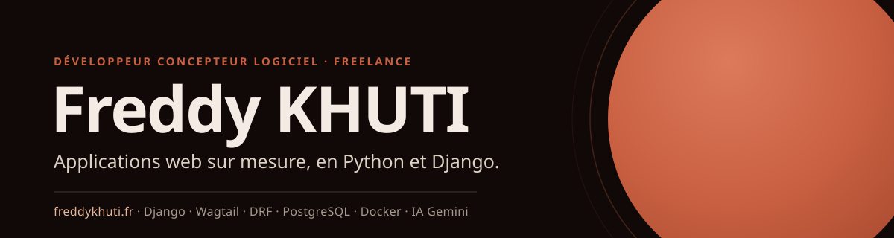
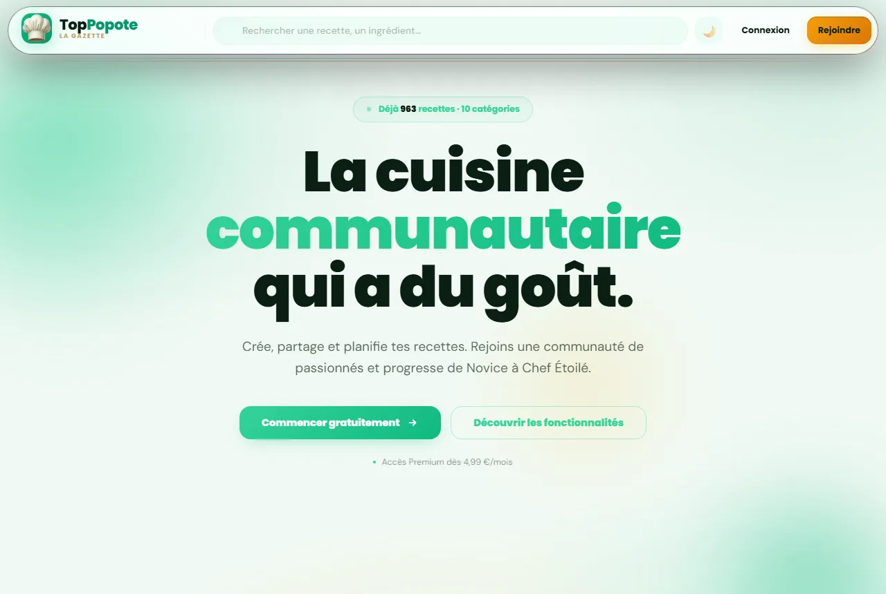
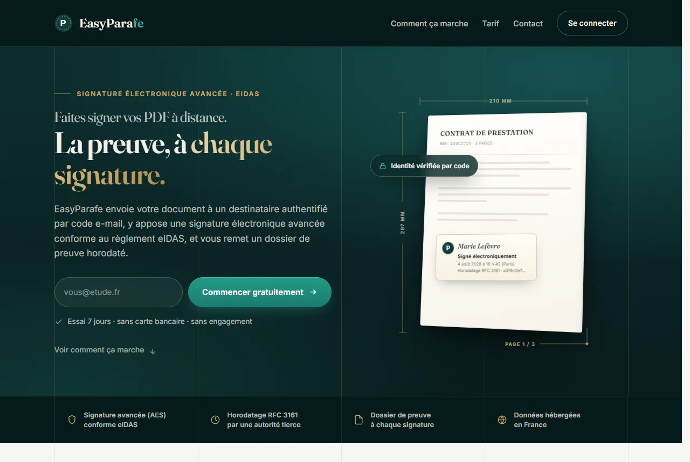

  

Développeur concepteur logiciel freelance, je conçois et livre des applications web sur mesure en Python et Django : modèle de données, interface, API, tests et déploiement sur serveur Linux. Trois produits sont en ligne aujourd'hui. Je suis disponible pour de nouveaux projets.

  
  
  

## En production

Trois applications que j'ai conçues, développées et mises en ligne. Leur code source est privé.

<table>
  <tr>
    <td width="33%" valign="top">
      
      <h3><a href="https://toppopote.fr">TopPopote</a></h3>
      
Application de cuisine : recettes, planning de repas et liste de courses. Import et structuration des recettes par IA.

      
Django 6 · PostgreSQL · Gemini · Stripe

    </td>
    <td width="33%" valign="top">
      
      <h3><a href="https://lemassage82.fr">LeMassage82</a></h3>
      
Site vitrine et réservation en ligne pour un salon de massage bien-être, avec un back-office Wagtail.

      
Wagtail 7 · Django 6 · PostgreSQL · Docker

    </td>
    <td width="33%" valign="top">
      
      <h3><a href="https://easyparafe.fr">EasyParafe</a></h3>
      
Signature électronique de PDF à distance, conforme eIDAS, avec dossier de preuve horodaté.

      
Django 5 · pyHanko (PAdES, RFC 3161) · PostgreSQL

    </td>
  </tr>
</table>

## Stack

  
  
  
  
  
  
  
  
  
  
  
  
  
  

Front-end en HTML, CSS et JavaScript natifs, sans framework. Mise en production sur VPS Linux : Nginx, Gunicorn et certificats Let's Encrypt.

## Parcours OpenClassrooms

Onze projets publics du parcours Développeur d'application Python, du premier scraper à la mise en production avec CI/CD.

**Fondamentaux Python et algorithmes**

- [booksOnline](https://github.com/Freddy0ne1/booksOnline) : scraper du catalogue Books to Scrape avec requests et BeautifulSoup, export CSV et téléchargement des images.
- [booksOnline_POO](https://github.com/Freddy0ne1/booksOnline_POO) : le même scraper refactorisé en programmation orientée objet.
- [tournois_club_echecs](https://github.com/Freddy0ne1/tournois_club_echecs) : gestion de tournois d'échecs en console, architecture MVC, code conforme Flake8.
- [AlgoInvestTrade](https://github.com/Freddy0ne1/AlgoInvestTrade) : sélection d'actions sous contrainte de budget, de la force brute à la programmation dynamique (sac à dos).

**Front-end et premiers pas avec Django**

- [juststreamit](https://github.com/Freddy0ne1/juststreamit) : interface de films en JavaScript vanilla, alimentée par une API REST locale.
- [django-web-app](https://github.com/Freddy0ne1/django-web-app) : premiers pas avec Django : modèles, migrations, vues, URL et templates.
- [LITReview](https://github.com/Freddy0ne1/LITReview) : application communautaire de critiques de livres, avec billets, abonnements et flux.

**API REST et architecture**

- [SoftDesk](https://github.com/Freddy0ne1/SoftDesk) : API REST de suivi de projets et de tickets avec Django REST Framework, JWT, permissions et respect du RGPD.
- [epic_events_crm](https://github.com/Freddy0ne1/epic_events_crm) : CRM en ligne de commande, PostgreSQL et SQLAlchemy, rôles, JWT, Argon2 et journalisation Sentry.

**Qualité logicielle, tests et DevOps**

- [Python_Testing](https://github.com/Freddy0ne1/Python_Testing) : débogage et couverture de tests d'une application Flask, avec pytest et des tests de charge Locust.
- [Python-OC-Lettings-FR](https://github.com/Freddy0ne1/Python-OC-Lettings-FR) : refonte d'un site Django en architecture modulaire, Docker, tests, pipeline CI/CD et Sentry.

## Me contacter

Un projet d'application web, une API à concevoir ou un site à moderniser ? Écrivez-moi à [freddykhuti@gmail.com](mailto:freddykhuti@gmail.com) ou via [freddykhuti.fr](https://freddykhuti.fr). **Je réponds sous 24 heures.**
